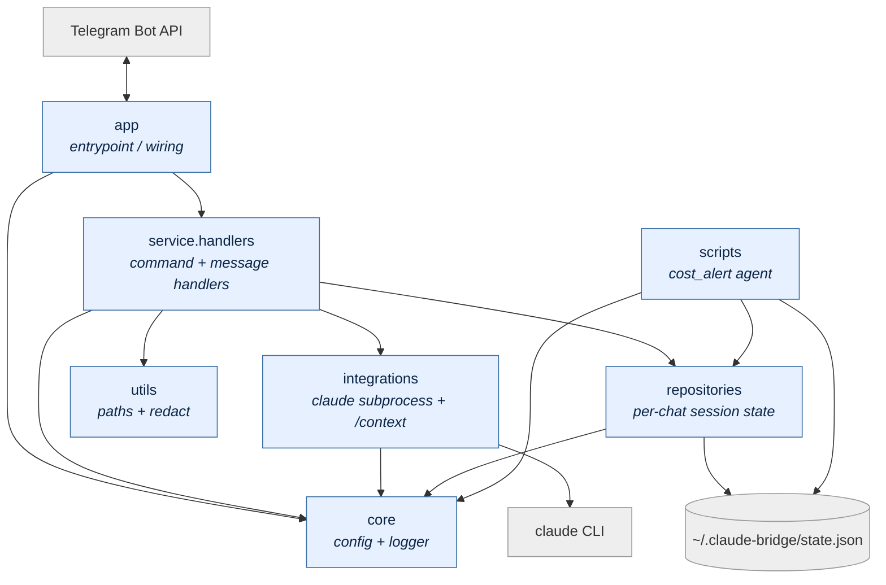

# claude-bridge

Telegram ↔ Claude Code CLI bridge running on the Mac. Lets you talk to the Claude Code subscription from your phone without installing Claude on mobile.

## Architecture

```
[Telegram app on phone]
        ↓
[Telegram Bot API]
        ↓ (long-poll)
[python -m app.main on the Mac via launchd]
        ↓ (subprocess)
[claude -p <prompt> --resume <session-id> --permission-mode acceptEdits]
```

Per-chat state persisted in `~/.claude-bridge/state.json` (session_id + cwd + `started` flag).

### Package diagram



Arrows read as "depends on". `core` and `utils` are leaves — they import nothing else in the project. `app` only wires; all business logic lives in `service.handlers` and `integrations`.

### Module layout

```
app/main.py                       # entrypoint (python -m app.main)
core/
├── config.py                     # env-var loading + defaults
└── logger.py                     # logging setup, shared `log`
utils/
├── paths.py                      # resolve_arg, is_cwd_allowed, safe_resolve
└── redact.py                     # scrub home path / emails / hex / api keys
integrations/
└── claude_client.py              # subprocess wrapper + extract_result_text
repositories/
└── session_repository.py         # state.json load/save + per-chat session
service/handlers/
├── __init__.py                   # register(app) wires all CommandHandlers
├── _common.py                    # authorized() + 1-arg is_cwd_allowed wrapper
├── start.py                      # /start, /status
├── session.py                    # /new
├── cwd.py                        # /cd, /pwd, /ls
├── effort.py                     # /effort
├── model.py                      # /model
├── context.py                    # /context
└── message.py                    # free-form text → claude CLI
run.sh                            # launchd entrypoint (sources .env, execs python -m app.main)
launchd/                          # versioned plist + install README
tests/                            # pytest, 93 cases
pyproject.toml                    # package declaration; `claude-bridge` console script
```

## Initial setup

### 1. Create the Telegram bot
- In Telegram, talk to `@BotFather` → `/newbot` → follow the prompts → save the **token**.
- Talk to `@userinfobot` → save your numeric **chat_id**.

### 2. Install local dependencies
```bash
cd ~/EDF/Personal/Github/claude-bridge
python3 -m venv .venv
.venv/bin/pip install -r requirements.txt
cp .env.example .env
# edit .env: fill in CLAUDE_BRIDGE_TG_TOKEN and CLAUDE_BRIDGE_ALLOWED_CHATS
chmod 600 .env
```

### 3. Foreground smoke test
```bash
./run.sh
# in another window: send /start to the bot in Telegram
# ctrl-c once it works
```

### 4. Enable as a service (launchd)
```bash
launchctl bootstrap gui/$UID ~/Library/LaunchAgents/com.local.claude-bridge.plist
launchctl print gui/$UID/com.local.claude-bridge | head -30
tail -f ~/.claude-bridge/launchd.err   # ctrl-c to exit
```

## Bot commands (in Telegram)

| Command | Function |
|---|---|
| `/start` | Show current session_id, cwd, and permission mode |
| `/status` | Alias for `/start` |
| `/new` | Generate a new session_id (clears conversation memory) |
| `/cd` | Show the current working directory |
| `/cd ~/EDF/BlindBet` | Change the working directory |
| `/pwd` | Print the current working directory |
| `/ls` | List entries in the current cwd |
| `/ls ~/EDF/BlindBet` | List entries in a path (must be inside an allowed root) |
| `/effort` | Show the effort level for this chat (or `(default)` if unset) |
| `/effort high` | Set effort for this chat. Valid: `low`, `medium`, `high`, `xhigh`, `max`, `none` (clears override) |
| `/model` | Show the model for this chat and the default |
| `/model opus` | Set model for this chat. Valid: `opus`, `sonnet`, `haiku`, `default` (resets to `CLAUDE_BRIDGE_MODEL`/`haiku`) |
| `/context` | Render a PNG mirroring Claude Code's `/context` view (10×20 grid + per-category breakdown: System prompt, System tools, MCP tools, Memory files, Skills, Messages, Free space, Autocompact buffer). Invokes `claude --resume <sid> -p "/context"`, which runs synthetically — `num_turns=0`, no token cost. |
| `<any text>` | Send as a prompt to Claude Code |

## Management (launchd)

```bash
# Inspect state (loaded? last exit? PID?)
launchctl print gui/$UID/com.local.claude-bridge

# Restart after editing code or .env
launchctl kickstart -k gui/$UID/com.local.claude-bridge

# Stop temporarily (keeps plist on disk)
launchctl bootout gui/$UID ~/Library/LaunchAgents/com.local.claude-bridge.plist

# Reload after editing the plist
launchctl bootout gui/$UID ~/Library/LaunchAgents/com.local.claude-bridge.plist
launchctl bootstrap gui/$UID ~/Library/LaunchAgents/com.local.claude-bridge.plist

# Remove permanently
launchctl bootout gui/$UID ~/Library/LaunchAgents/com.local.claude-bridge.plist
rm ~/Library/LaunchAgents/com.local.claude-bridge.plist

# Validate plist syntax before reloading
plutil -lint ~/Library/LaunchAgents/com.local.claude-bridge.plist
```

## Logs

Three rotating sinks under `~/.claude-bridge/` (5 MB × 5 backups each):

| File | Scope |
|---|---|
| `bridge.log` | Operational app log at the configured level (default `INFO`): handler entries, session state, claude CLI exit codes, unhandled exception tracebacks. This is the file to grep when troubleshooting. |
| `conversation.log` | Prompt/response history only — one line per inbound prompt and one per outbound reply, redacted via `utils/redact` and truncated at 4000 chars. Use this to review what was actually said. |
| `permissions.log` | Audit trail of every tool call the Claude CLI denied for permission reasons (one line per denial: tool name + redacted, truncated `tool_input`). Empty when `CLAUDE_BRIDGE_PERMISSION_MODE=bypassPermissions` since nothing is ever denied. |
| `launchd.err` | Captured by launchd. Receives `WARNING+` from the app plus anything the Python interpreter writes to stderr before logging is configured (import errors, missing env vars, crash tracebacks from launchd restarts). Stays quiet in normal operation. |
| `launchd.out` | Captured by launchd stdout. Normally empty — the app does not print to stdout. |
| `state.json` | Per-chat session state (not a log). |

```bash
tail -50 ~/.claude-bridge/bridge.log
tail -50 ~/.claude-bridge/conversation.log
tail -50 ~/.claude-bridge/permissions.log
tail -50 ~/.claude-bridge/launchd.err
```

### Log level

Set `CLAUDE_BRIDGE_LOG_LEVEL` in `.env` to one of `DEBUG`, `INFO` (default), `WARNING`, `ERROR`, `CRITICAL`. Invalid values silently fall back to `INFO`. The level applies to `bridge.log` and `conversation.log`; `launchd.err` is pinned at `WARNING` regardless, so raising the level here will not flood it. Reload after editing: `launchctl kickstart -k gui/$UID/com.local.claude-bridge`.

Third-party loggers (`httpx`, `httpcore`, `telegram`) are pinned at `WARNING` to keep the polling chatter out of the logs.

## Configuration (.env)

| Variable | Default | Notes |
|---|---|---|
| `CLAUDE_BRIDGE_TG_TOKEN` | (required) | Token from BotFather |
| `CLAUDE_BRIDGE_ALLOWED_CHATS` | (required) | Comma-separated numeric `chat_id`s |
| `CLAUDE_BRIDGE_CWD` | `~/EDF/Personal/Github` | Default working directory for new sessions |
| `CLAUDE_BRIDGE_CWD_ROOTS` | `~/EDF/Personal/Github,~/EDF/BlindBet` | Allowlist of roots `/cd` may switch into (comma-separated). `DEFAULT_CWD` must be under one of these or the bot refuses to start. Symlinks are resolved before the check. |
| `CLAUDE_BRIDGE_PERMISSION_MODE` | `acceptEdits` | See "Security" and "Permission notifications" below. Valid: `default`, `acceptEdits`, `plan`, `bypassPermissions`, `auto`, `dontAsk`. |
| `CLAUDE_BRIDGE_TIMEOUT` | `600` | Per-message timeout in seconds |
| `CLAUDE_BRIDGE_EFFORT` | (unset) | Default effort level passed as `--effort` to the Claude CLI. One of `low`, `medium`, `high`, `xhigh`, `max`. Per-chat override via `/effort`. |
| `CLAUDE_BRIDGE_MODEL` | `haiku` | Default model passed as `--model` to the Claude CLI. One of `opus`, `sonnet`, `haiku`. Per-chat override via `/model`. Haiku is the default to keep costs low. |
| `CLAUDE_BRIDGE_LOG_LEVEL` | `INFO` | App-log level for `bridge.log` / `conversation.log`. One of `DEBUG`, `INFO`, `WARNING`, `ERROR`, `CRITICAL`. `launchd.err` stays pinned at `WARNING`. See "Logs" above. |
| `COST_ALERT_ENABLED` | `true` | Enable the hourly cost-alert agent. See "Cost Alert" below. |
| `COST_ALERT_THRESHOLD_USD` | `10` | Trigger an email when any tracked session's transcript cost exceeds this value. |
| `COST_ALERT_RECIPIENT` | `leoabrahao@gmail.com` | Recipient address for alerts (sent via Mail.app). |
| `COST_ALERT_INTERVAL_SECONDS` | `3600` | Polling interval used by the launchd plist; also the dedupe window. |

After editing `.env`, reload with `launchctl kickstart -k gui/$UID/com.local.claude-bridge`.

## Security

- **Chat allowlist** — only chats in `CLAUDE_BRIDGE_ALLOWED_CHATS` get replies; everyone else sees "Unauthorized".
- **Permission mode** — defaults to `acceptEdits`: Claude can edit files inside `cwd` automatically, but shell commands and other sensitive tool calls are denied (and surfaced — see below). Override to `bypassPermissions` only if you need fully unattended execution; that disables all guards and Claude can run arbitrary shell commands.
  - Keep `cwd` in a safe directory (not `$HOME` root).
  - Migrating from a previous install: existing `.env` files that still set `CLAUDE_BRIDGE_PERMISSION_MODE=bypassPermissions` keep working as before. Unset the variable to pick up the new `acceptEdits` default.
- **Token and chat_id in `.env`** — chmod 600. Never commit to git.

## Permission notifications

In modes other than `bypassPermissions`, the Claude CLI denies any tool call that lacks pre-granted permission (e.g. `Bash`, writes outside `cwd`). The bridge surfaces every such denial in two places:

- A Telegram reply prefixed `⚠️ Claude pediu permissão para N ação(ões) e foi bloqueado (modo: acceptEdits):` listing the `tool_name` and a truncated, redacted preview of `tool_input` (one bullet per denial). Sent before the regular result message so the user sees both.
- One line per denial appended to `~/.claude-bridge/permissions.log` (audit trail, also redacted/truncated).

Today the flow is one-way (notification only) — there is no Sim/Não button to grant permission in-turn. If you need that, switch the chat to a project where the edit is auto-allowed, or re-run with `CLAUDE_BRIDGE_PERMISSION_MODE=bypassPermissions` temporarily.

## Cost Alert

Hourly `launchd` agent that watches active sessions and emails when any one exceeds `COST_ALERT_THRESHOLD_USD`.

- `scripts/cost_alert.py` reads `~/.claude-bridge/state.json`, locates each tracked session's transcript at `~/.claude/projects/*/<session_id>.jsonl`, and aggregates cost (`costUSD` summed; `total_cost_usd` taken as a max fallback).
- Alerts are sent via Mail.app (`osascript`) and deduped per `YYYY-MM-DD-HH` UTC window using `~/.claude-bridge/cost-alert-state.json`. A session that stays above threshold for hours triggers at most one email per hour.

### Install

```bash
bash scripts/install_cost_alert.sh
```

The script lints the plist, copies it to `~/Library/LaunchAgents/`, then bootstraps and kickstarts it.

### Smoke test

```bash
COST_ALERT_THRESHOLD_USD=0.01 bash scripts/run_cost_alert.sh
tail -20 ~/.claude-bridge/cost-alert.out
```

You should receive an email within a few seconds for any session whose transcript has any cost recorded.

### Uninstall

```bash
bash scripts/uninstall_cost_alert.sh
```

### Inspect

```bash
launchctl print gui/$UID/com.local.claude.cost-alert
tail -50 ~/.claude-bridge/cost-alert.out
tail -50 ~/.claude-bridge/cost-alert.err
cat ~/.claude-bridge/cost-alert-state.json
```

### Troubleshooting

| Symptom | Likely cause | Fix |
|---|---|---|
| No email arrives | Mail.app Automation permission was revoked | System Settings → Privacy & Security → Automation → enable `osascript` → Mail |
| `last exit code = 1` | `.env` perms wrong or python import error | `tail ~/.claude-bridge/cost-alert.err` |
| Same alert every hour | Expected — dedupe window is 1h; raise `COST_ALERT_INTERVAL_SECONDS` if too noisy |
| Plist refused to bootstrap | Syntax error | `plutil -lint launchd/com.local.claude.cost-alert.plist` |

## Troubleshooting

| Symptom | Likely cause | Fix |
|---|---|---|
| Bot does not reply on Telegram | Service is not running | `launchctl print gui/$UID/com.local.claude-bridge` — if "could not find service", reload |
| `last exit code` ≠ 0 | Error in `app/main.py` or missing `.env` | `tail -50 ~/.claude-bridge/launchd.err` |
| "Unauthorized" reply on Telegram | Your chat_id is not in `ALLOWED_CHATS` | Re-fetch via `@userinfobot`, update `.env`, kickstart |
| `claude: command not found` in logs | Plist `PATH` does not include `/opt/homebrew/bin` | Check the `EnvironmentVariables` block in the plist |
| Reply is cut off | Message >4000 chars | Expected — the bot splits into chunks; confirm all arrived |
| Session "forgot" context | Mac slept or bot restarted | State persists in `~/.claude-bridge/state.json`; `--resume` continues working after restart |

## Stack

- `python-telegram-bot>=21.0` (long-polling)
- `claude` CLI (authenticated on the Mac)
- launchd (not cron — recovers from sleep, auto-restart on crash)
